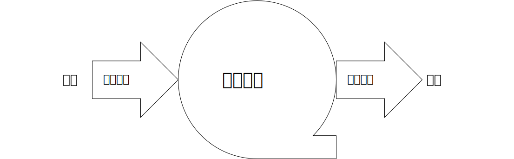
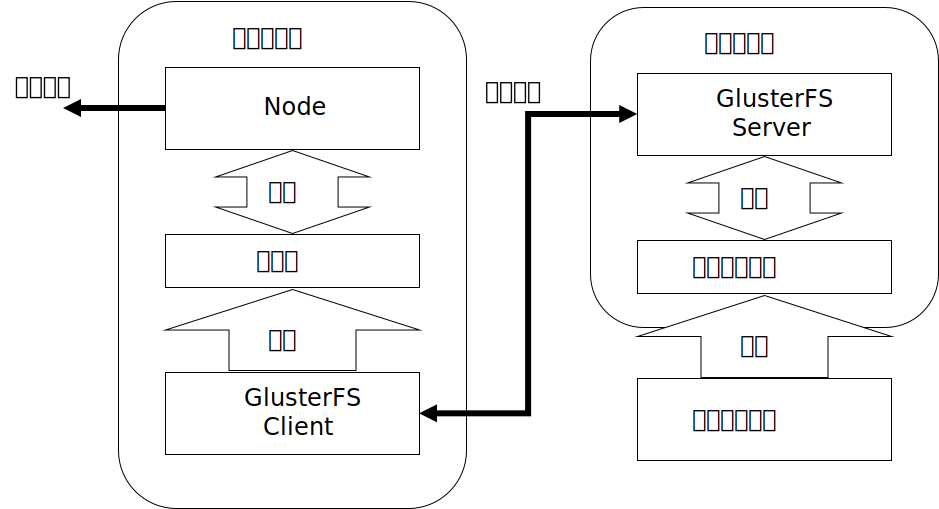

# ArchievesCenter

## Description



* 本项目是无锡市软测认证有限公司的档案服务
* 项目基于Node.js，其本质是一个流式的文件存取服务

## Software Architecture



本项目的软件结构包含两个部分：

* 本项目只是一个简单的网络文件存取系统，采用node.js的流式传输方式以保证大文件传输时的性能

* 客户端：
  * 包含GlusterFS客户端和由Node实现的网络接口
  * 本身不存在文件存储能力，使用时必须指定至少一个服务端
* 服务端：
  * GlusterFS服务端的封装
  * 与客户端通信，提供文件存储服务

## Installation

* 文件存放路径由`process.env.npm_config_dir`获得，即被上传的文件存放在`npm start --dir=XX`命令行参数指定的文件目录下（具体情况请自行搜索`process.env.npm_config_*`）。若没有命令行参数，则默认为`process.cwd()`。
* 如上所述，若启用GlusterFS的分布式存储功能，只需要用`--dir=XX`指定要存储的GlusterFS虚拟卷即可

### 不启用GlusterFS

1. 下载本工程
2. 构建一个镜像👇

```sh
docker build -t archieves_center .
```

3. 直接启动👇

```sh
docker run --rm -it -p 3000:3000 archieves_center npm start
```

此举将使上传的文件存储至容器中的`/app`目录下，此目录下有很多工程文件，不适合作为存储文件的地方，若要将文件存储至其他目录，可以添加命令行参数👇

```sh
docker run --rm -it -p 3000:3000 archieves_center npm start --dir=某个相对路径或绝对路径
```

这样上传的文件就会被存到`--dir`指定的路径下了。进一步，镜像还提供了一个可挂载的目录`/data`，因此可以挂载虚拟卷从而将文件持久化存储👇

```sh
docker run --rm -it -p 3000:3000 -v /your/path/to/data:/data archieves_center npm start --dir=/data
```

### 启用GlusterFS

**一个直接使用官方镜像的配置案例可见`_test`文件夹**

#### 首先要启动至少一个GlusterFS服务端

要启用GlusterFS，必须先有至少一个服务端，服务端和集群的具体配置方式可见[官方Docker hub](https://hub.docker.com/r/gluster/glusterfs-client)

#### 然后才能启动GlusterFS客户端

##### 此镜像自带的简便方法

在启动容器时添加下列环境变量：

* `GLUSTERFS_SERVER_ADDR`：GlusterFS服务器地址（IP或域名均可）。若不指定则不启动GlusterFS客户端
* `GLUSTERFS_VOLUME`：要挂载的GlusterFS服务器卷名称。若不指定则不启动GlusterFS客户端
* `GLUSTERFS_MOUNTDIR`：要将GlusterFS挂载到哪个目录下。若不指定则默认为`/data`
* `DATA_DIR`：应用要将文件存储在哪个目录下，将此目录设为`GLUSTERFS_MOUNTDIR`或者其下属的某个子目录，就能让上传的文件存到GlusterFS里面去。若不指定则默认为`/data`

上面这些系统变量将会融合为下面👇这两条指令，用于启动客户端（具体的指令在启动脚本`start.sh`里面，此脚本通过`CMD["/app/start.sh"]`指定为容器启动脚本）：

```sh
mount -t glusterfs ${GLUSTERFS_SERVER_ADDR}:${GLUSTERFS_VOLUME} ${GLUSTERFS_MOUNTDIR}
npm start --dir=${DATA_DIR}
```

##### 自行启动

上面自带的启动方法仅使用了GlusterFS的默认配置，如果此配置不能满足需求，可以自行配置启动。基本的启动指令就如上面写的那两条，用`mount -t glusterfs ...`挂载镜像，`npm start ...`启动应用。

客户端的Node应用启动方法和不启用GlusterFS时相同，不同的是在运行`npm start`之前要先挂载一个GlusterFS虚拟卷，并用`npm start --dir=XXX`指定文件存储目录为挂载的虚拟卷。客户端挂载虚拟卷的方法可见[官方教程](https://docs.gluster.org/en/latest/Administrator%20Guide/Setting%20Up%20Clients#manually-mounting-volumes)。

#### Instructions

1.  xxxx
2.  xxxx
3.  xxxx

## Contribution

1.  Fork the repository
2.  Create Feat_xxx branch
3.  Commit your code
4.  Create Pull Request


## Gitee Feature

1.  You can use Readme\_XXX.md to support different languages, such as Readme\_en.md, Readme\_zh.md
2.  Gitee blog [blog.gitee.com](https://blog.gitee.com)
3.  Explore open source project [https://gitee.com/explore](https://gitee.com/explore)
4.  The most valuable open source project [GVP](https://gitee.com/gvp)
5.  The manual of Gitee [https://gitee.com/help](https://gitee.com/help)
6.  The most popular members  [https://gitee.com/gitee-stars/](https://gitee.com/gitee-stars/)
